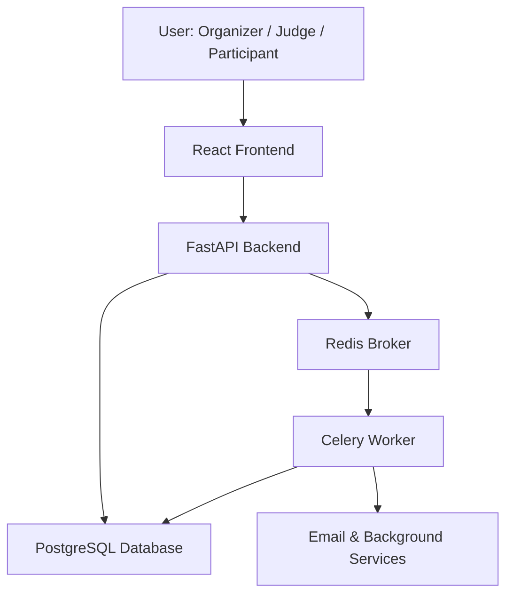
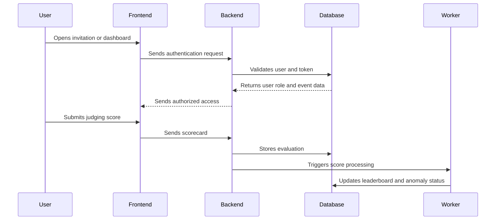

# 🚀 SmartHack — Intelligent Hackathon Management Platform

SmartHack is a full-stack hackathon management platform built to simplify the complete event workflow — from participant onboarding and team creation to judging, score analysis, leaderboard generation, and organizer control.

The platform focuses on automation, fairness, and scalability by using secure authentication, background processing, intelligent team matching, and statistical anomaly detection.

---

## 🔧 Tech Stack


---

## 📌 Overview

Managing a hackathon manually can become difficult when there are many participants, teams, judges, scorecards, and result stages.

SmartHack solves this by providing a centralized platform where organizers can manage events, participants can access their assigned flow, judges can evaluate teams, and the system can automatically process scores and detect unusual judging patterns.

---

## ✨ Key Features

### 👥 Participant Management

* Participant registration
* Profile and role-based access
* Event-specific participant tracking
* Team allocation support
* Secure invitation flow

---

### 🧠 Intelligent Team Matching

SmartHack includes a team formation engine that can group participants based on multiple constraints such as:

* Skills
* Experience level
* Institution diversity
* Team size
* Technology preferences

This helps organizers create more balanced and fair teams instead of assigning participants manually.

---

### ⚖️ Judging Workflow

Judges can evaluate teams using structured scorecards and predefined judging parameters.

Supported judging flow:

* Judge dashboard
* Score submission
* Rubric-based evaluation
* Multi-judge scoring
* Score aggregation
* Leaderboard generation

---

### 📊 Score Anomaly Detection

SmartHack uses statistical analysis to detect unusual score patterns during judging.

The anomaly detection system checks score variations across parameters such as:

* Innovation
* Code quality
* Presentation
* Impact

If a scorecard is significantly different from the panel average, the system can flag it for organizer review before final results are published.

---

### 🔐 Secure Access System

The platform supports secure authentication and access control using:

* JWT-based authentication
* Role-based authorization
* Magic link verification
* Single-use token validation
* Token replay protection

This ensures that organizers, judges, and participants can only access the sections assigned to them.

---

### ⚡ Background Processing

SmartHack uses Celery and Redis to handle long-running tasks asynchronously.

Background tasks include:

* Email sending
* Score recalculation
* Leaderboard updates
* Anomaly checks
* Automated notifications

This improves backend performance and avoids blocking API requests.

---

## 🏗️ System Architecture



---

## 🔄 Application Flow



---

## 📁 Project Structure

```bash
SmartHack/
│
├── backend/
│   ├── app/
│   │   ├── api/              # API routes
│   │   ├── core/             # Auth and config
│   │   ├── models/           # Database models
│   │   ├── schemas/          # Request/response schemas
│   │   ├── services/         # Business logic
│   │   └── utils/            # Helper functions
│   │
│   └── requirements.txt
│
├── frontend/
│   ├── src/
│   │   ├── components/       # Reusable UI components
│   │   ├── pages/            # App pages
│   │   ├── services/         # API calls
│   │   └── hooks/            # Custom hooks
│   │
│   └── package.json
│
├── ai_app/
│   ├── celery_app.py         # Celery configuration
│   └── tasks/                # Background jobs
│
├── docker-compose.yml
└── README.md
```

---

## 🧩 Core Modules

### Organizer Module

* Create and manage events
* Track participant data
* Manage judges
* Monitor team allocation
* Review flagged scorecards
* Control leaderboard publishing

---

### Participant Module

* Access event dashboard
* View team assignment
* Submit required details
* Receive event updates
* Track event progress

---

### Judge Module

* View assigned teams
* Submit evaluation scores
* Use structured judging rubrics
* Review submitted evaluations

---

### Scoring Module

* Stores judge scorecards
* Calculates average scores
* Updates leaderboard
* Detects scoring anomalies
* Supports manual review flow

---

### Background Worker Module

* Runs async jobs
* Processes leaderboard updates
* Sends emails
* Performs anomaly checks
* Handles scheduled tasks

---

## 🛡️ Security Highlights

* JWT authentication for protected routes
* Magic link based access
* Unique token identifier for each login link
* Single-use token validation
* Role-based route protection
* Environment-based secret management
* Secure API request validation

---

## 🚀 Getting Started

### 1. Clone the Repository

```bash
git clone https://github.com/OJASWANI-tech/SmartHack.git
cd SmartHack
```

---

### 2. Run Using Docker

```bash
docker-compose up --build
```

This starts:

* FastAPI backend
* React frontend
* PostgreSQL database
* Redis server
* Celery worker

---

## 🖥️ Manual Setup

### Backend Setup

```bash
cd backend

python -m venv venv

source venv/bin/activate

pip install -r requirements.txt

uvicorn app.main:app --reload --port 8000
```

For Windows:

```bash
venv\Scripts\activate
```

---

### Frontend Setup

```bash
cd frontend

npm install

npm run dev
```

---

### Celery Worker Setup

```bash
cd ai_app

celery -A celery_app worker --loglevel=info
```

---

## 🔑 Environment Variables

Create a `.env` file inside the backend folder.

```env
DATABASE_URL=postgresql+asyncpg://postgres:<password>@localhost:5432/smarthack
REDIS_URL=redis://localhost:6379
SECRET_KEY=your_secret_key
RESEND_API_KEY=your_resend_api_key
```

---

## 🧪 Utility Scripts

The project can include helper scripts for local development and testing.

```bash
python seed_data.py
```

Seeds sample participants, teams, events, and judging data.

```bash
python reset_db.py
```

Resets development database tables.

```bash
python check_finalized_teams.py
```

Checks team and score consistency.

---

## 📈 Performance Optimizations

* Async backend using FastAPI
* Redis-based background queue
* Celery workers for heavy tasks
* PostgreSQL for structured data storage
* API separation between frontend and backend
* Background leaderboard computation
* Non-blocking email and scoring operations

---

## 📊 Use Cases

SmartHack can be used for:

* College hackathons
* Coding competitions
* Innovation challenges
* Technical fests
* Ideathons
* Project evaluation events
* Multi-round competitions

---

## 🔮 Future Enhancements

* AI-generated judge feedback
* Plagiarism detection for submissions
* Real-time event analytics
* Resume-based participant matching
* Live notifications
* Admin analytics dashboard
* Multi-event organization support
* Deployment on cloud platforms

---

## 📌 Project Status

SmartHack is designed as a scalable full-stack project for hackathon and event management. It demonstrates backend architecture, frontend development, authentication, database design, background processing, and intelligent automation.

---

## 📄 License

This project is created for learning, portfolio building, and hackathon/event management use cases.
